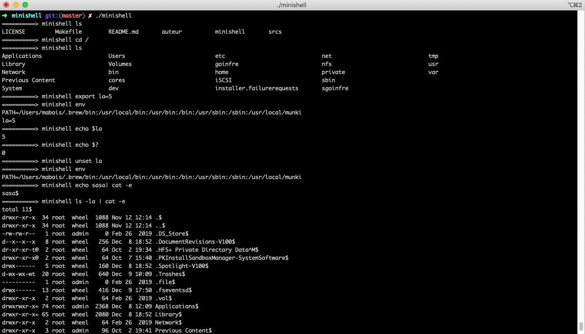

# minishell

A shell implementation with simple functionalities.

## Instruction
You need to specify your home path in the `minishell.h`

## Compiling
Run `make`.

## License
This project is licensed under the GNU General Public License 3.
